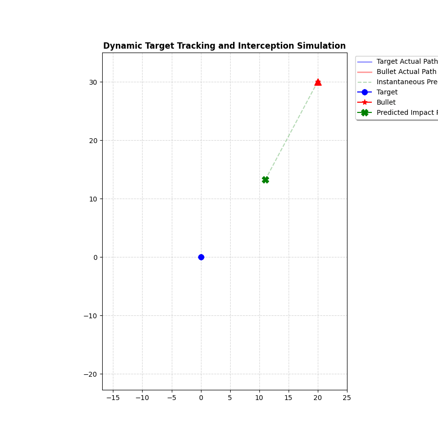

# Dynamic Target Tracking and Interception Simulation
<p align="center">
  
</p>
This project is a 2D guidance and tracking system simulation that continuously calculates instantaneous intercept points to track and neutralize a dynamic target exhibiting non-linear maneuvers (random angular deviations).

Rather than simply aiming at the target's instantaneous position, the system iteratively solves a quadratic vector equation at each simulation step ($dt$) to project the optimal intercept trajectory for a constant-speed projectile (launcher).

## 📌 Project Features

* **Closed-Loop Guidance:** The projectile dynamically adjusts its course at every frame based on the target's updating velocity vector and path deviations, ensuring reliable interception even against unpredictable motion.
* **Vector Intercept Mathematics:** Analytical calculation of the exact interception time ($t_{st}$) and velocity vector using quadratic equation coefficients.
* **Real-Time Visualization:** Powered by `matplotlib.animation.FuncAnimation` to display the target's trajectory, the projectile's path, and the dynamically shifting predicted impact point.
* **Robust Fallback Mechanism:** Includes a direct pursuit mechanism (`fallback_direct_aim`) when geometric conditions make analytical interception mathematically impossible (e.g., target speed exceeding projectile speed in certain vectors).

## 📐 Mathematical Framework (Intercept Algorithm)

Let $L$ be the initial/current launcher position, $M$ be the projectile speed magnitude, $P$ be the target's instantaneous position vector, and $V$ be the target's velocity vector. For the projectile and target to collide at a future time $t$, the following vector equality must hold:

$$
P + t \cdot V = L + t \cdot M_d
$$

Where $M_d$ represents the projectile's velocity vector, satisfying $\Vert M_d \Vert = M$. Squaring both sides and converting the system into a quadratic equation ($at^2 + bt + c = 0$) yields the following coefficients:

* $a = \Vert V \Vert^2 - M^2$
* $b = 2 \cdot (V \cdot (P - L))$
* $c = \Vert P - L \Vert^2$

The discriminant ($\Delta = b^2 - 4ac$) is checked at each step. If $\Delta \ge 0$, the smallest positive real time root ($t_{st}$) is selected to compute the predicted collision point $B$ and the required velocity vector $M_d$:

$$
B = P + t_{st} \cdot V
$$

$$
M_d = \frac{B - L}{t_{st}}
$$

## 📂 File Structure

* **`calculations.py`**: Contains analytical geometry and linear algebra functions responsible for computing discriminants, time roots, and trajectory vectors.
* **`visualize.py`**: The core driver script that injects pseudo-random noise/turns (`max_turn_angle`) into the target's path, executes the tracking loop, and renders the dynamic simulation interface.
* **`hit_animation.gif`**: The example showcase of the output simulation. GIF is produced by using only 1/5 of the original frames, reducing the size and build time. It is open to view from the files.

## 🚀 Getting Started

### Prerequisites

Ensure you have Python 3.x along with the required scientific computing and visualization libraries installed:

```bash
pip install numpy matplotlib
```

## Simulation Visual Components
Upon running, the simulation window renders the following real-time elements:
- 🟦 Blue Line / Dot: The actual path and current position of the maneuvering target.
- 🟥 Red Line / Star: The projectile's position history and its active interception course.
- 🟩 Green Dashed Line / "X" Marker: The instantaneously predicted intercept point ($B$).
  You can observe this point dynamically shift whenever the target executes a turn.
- 🔺 Red Triangle: The static launcher base station ($L$) where the projectile originated.

## License
This project is my own original work, and I do not consent to any commercial or profitable use of it. Permission to use the code, observations, and outputs is granted solely to individuals conducting academic or personal research.
