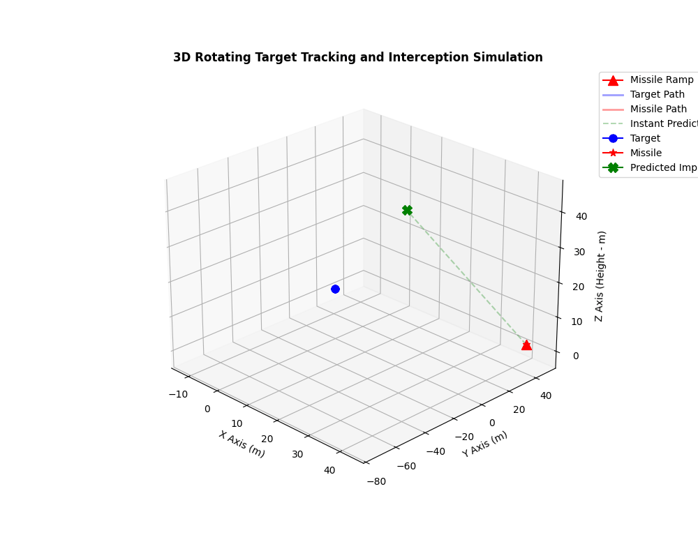

# TargetCatcherMissile

This project is a nonlinear target-tracking and interception simulation that monitors a moving target and attempts to intercept it. The same core algorithm is implemented for both 2D and 3D environments.

## 🎬 Preview of the Simulations

<p align="center">
  <table>
    <tr>
      <td align="center">
        
        <br><b>2D Simulation</b>
      </td>
      <td align="center">
        
        <br><b>3D Simulation</b>
      </td>
    </tr>
  </table>
</p>

## 🧠 About the Project

Instead of simply following the target's instantaneous position, this work computes the most suitable interception time and direction at each step. As a result, the missile or projectile can be redirected based on the target's predicted movement.

- The 2D version tracks the target in a plane.
- The 3D version simulates motion in space using azimuth and elevation angles.
- In both versions, a new interception estimate is recalculated whenever the target changes direction.

## ✨ Features

- Uses a quadratic equation to compute the instantaneous interception time.
- Generates a new interception direction based on the target's changing velocity vector.
- Provides real-time visualization through Matplotlib animations.
- Includes a safe fallback mechanism that switches to direct pursuit when a mathematical solution is unavailable.
- Implements the same logic for both 2D and 3D scenarios, with different spatial structures.

## 📐 Core Mathematics

At each step, the target position $P$, velocity $V$, missile position $L$, and missile speed $M$ are used. The interception condition is solved through the following relation:

$$
P + t \cdot V = L + t \cdot M_d
$$

From this, a quadratic equation is obtained:

$$
a = \|V\|^2 - M^2
$$

$$
b = 2 \cdot (V \cdot (P - L))
$$

$$
c = \|P - L\|^2
$$

The positive real root of $at^2 + bt + c = 0$ is selected. That root produces the predicted interception point and the required direction vector.

## 📁 File Structure

- [calculations.py](calculations.py): Contains the collision/interception calculation logic used by both 2D and 3D simulations.
- [visualize.py](visualize.py): Main script for the 2D animated simulation.
- [visualize_3d.py](visualize_3d.py): Main script for the 3D animated simulation.
- [hit_animation.gif](hit_animation.gif): Example GIF output for the 2D simulation.
- [hit_animation_3d_rotated.gif](hit_animation_3d_rotated.gif): Example GIF output for the 3D simulation.

## ▶️ Installation and Usage

### Requirements

Python 3.x and the following libraries are required:

```bash
pip install numpy matplotlib
```

### Running the Simulations

2D simulation:

```bash
python visualize.py
```

3D simulation:

```bash
python visualize_3d.py
```

## 🎯 Visual Elements

The simulation window displays the following elements:

- Blue line/dot: The target's actual path and current position
- Red line/star: The missile's actual path and current position
- Green dashed line: The instantaneous interception estimate
- Red triangle: The missile launch point / ramp

## 📜 License

This project was created as an original work. Commercial use is not permitted. The use of the code, observations, and outputs is restricted to academic or personal research purposes.
